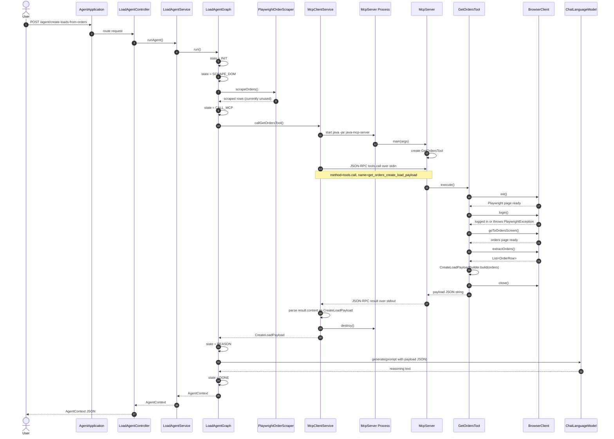
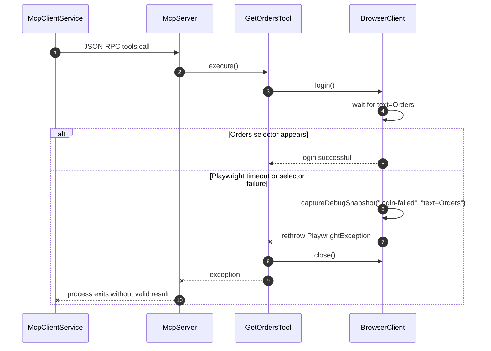

# MCP Server and Agent Application Sequence

```mermaid
sequenceDiagram
    autonumber
    actor User
    participant AgentApplication
    participant LoadAgentController
    participant LoadAgentService
    participant LoadAgentGraph
    participant PlaywrightOrderScraper
    participant McpClientService
    participant McpServerProcess as McpServer Process
    participant McpServer
    participant GetOrdersTool
    participant BrowserClient
    participant LLM as ChatLanguageModel

    User->>AgentApplication: POST /agent/create-loads-from-orders
    AgentApplication->>LoadAgentController: route request
    LoadAgentController->>LoadAgentService: runAgent()
    LoadAgentService->>LoadAgentGraph: run()

    LoadAgentGraph->>LoadAgentGraph: state = INIT
    LoadAgentGraph->>LoadAgentGraph: state = SCRAPE_DOM
    LoadAgentGraph->>PlaywrightOrderScraper: scrapeOrders()
    PlaywrightOrderScraper-->>LoadAgentGraph: scraped rows (currently unused)

    LoadAgentGraph->>LoadAgentGraph: state = CALL_MCP
    LoadAgentGraph->>McpClientService: callGetOrdersTool()
    McpClientService->>McpServerProcess: start java -jar java-mcp-server
    McpServerProcess->>McpServer: main(args)
    McpServer->>McpServer: create GetOrdersTool

    McpClientService->>McpServer: JSON-RPC tools.call over stdin
    Note over McpClientService,McpServer: method=tools.call, name=get_orders_create_load_payload

    McpServer->>GetOrdersTool: execute()
    GetOrdersTool->>BrowserClient: init()
    BrowserClient-->>GetOrdersTool: Playwright page ready
    GetOrdersTool->>BrowserClient: login()
    BrowserClient-->>GetOrdersTool: logged in or throws PlaywrightException
    GetOrdersTool->>BrowserClient: goToOrdersScreen()
    BrowserClient-->>GetOrdersTool: orders page ready
    GetOrdersTool->>BrowserClient: extractOrders()
    BrowserClient-->>GetOrdersTool: List<OrderRow>
    GetOrdersTool->>GetOrdersTool: CreateLoadPayloadBuilder.build(orders)
    GetOrdersTool->>BrowserClient: close()
    GetOrdersTool-->>McpServer: payload JSON string

    McpServer-->>McpClientService: JSON-RPC result over stdout
    McpClientService->>McpClientService: parse result.content as CreateLoadPayload
    McpClientService->>McpServerProcess: destroy()
    McpClientService-->>LoadAgentGraph: CreateLoadPayload

    LoadAgentGraph->>LoadAgentGraph: state = REASON
    LoadAgentGraph->>LLM: generate(prompt with payload JSON)
    LLM-->>LoadAgentGraph: reasoning text
    LoadAgentGraph->>LoadAgentGraph: state = DONE
    LoadAgentGraph-->>LoadAgentService: AgentContext
    LoadAgentService-->>LoadAgentController: AgentContext
    LoadAgentController-->>User: AgentContext JSON
```

## Failure Path Around Login

```mermaid
sequenceDiagram
    autonumber
    participant McpClientService
    participant McpServer
    participant GetOrdersTool
    participant BrowserClient

    McpClientService->>McpServer: JSON-RPC tools.call
    McpServer->>GetOrdersTool: execute()
    GetOrdersTool->>BrowserClient: login()
    BrowserClient->>BrowserClient: wait for text=Orders

    alt Orders selector appears
        BrowserClient-->>GetOrdersTool: login successful
    else Playwright timeout or selector failure
        BrowserClient->>BrowserClient: captureDebugSnapshot("login-failed", "text=Orders")
        BrowserClient--xGetOrdersTool: rethrow PlaywrightException
        GetOrdersTool->>BrowserClient: close()
        GetOrdersTool--xMcpServer: exception
        McpServer--xMcpClientService: process exits without valid result
    end
```
