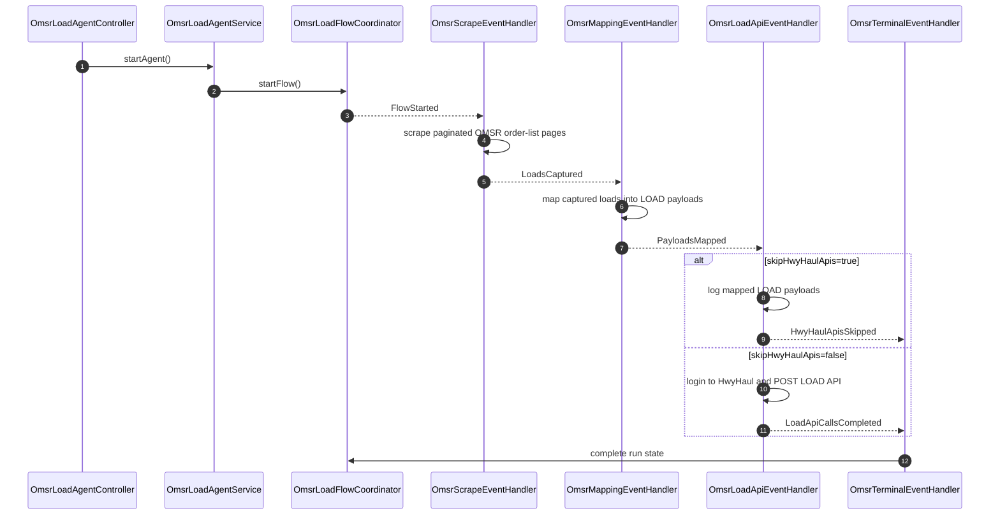

# OMSR Event Flow

The OMSR load creation path is driven by Spring application events. The synchronous compatibility endpoint still blocks until the run completes, but it now waits on the same event-driven run state used by the async endpoints.

## Endpoints

- `POST /agent/omsr/create-load-payload`: starts an OMSR run and waits for completion.
- `POST /agent/omsr/runs`: starts an OMSR run asynchronously and returns a `runId`.
- `GET /agent/omsr/runs/{runId}`: returns the current or final `AgentContext` for that run.
- `POST /agent/omsr/jobs/load`: triggers an OMSR load job and returns its `jobId` plus backing `runId`.
- `GET /agent/omsr/jobs/{jobId}`: returns job status and refreshes it from the backing run.
- `GET /agent/omsr/jobs/latest`: returns the latest triggered job status.

The three OMSR start endpoints accept these optional query parameters:

- `skipHwyHaulApis=true|false`: default is `false`.
- `detailScrapeConcurrency=1`: default is `1`; set a higher value to scrape multiple OMSR load detail pages in parallel after the order-list pages are collected.
- `maxLoadsToExtract=0`: default is `0`, which means no per-run extraction cap. Set a positive value to scrape at most that many new OMSR load detail pages after completed loads are skipped.
- `loadApiConcurrency=1`: default is `1`; set a higher value to POST multiple mapped HwyHaul LOAD API requests in parallel after one HwyHaul auth token is captured.

Examples:

```text
POST /agent/omsr/create-load-payload?skipHwyHaulApis=true
POST /agent/omsr/runs?skipHwyHaulApis=true
POST /agent/omsr/jobs/load?skipHwyHaulApis=true
POST /agent/omsr/jobs/load?skipHwyHaulApis=true&detailScrapeConcurrency=4
POST /agent/omsr/jobs/load?skipHwyHaulApis=true&detailScrapeConcurrency=4&maxLoadsToExtract=10
POST /agent/omsr/jobs/load?detailScrapeConcurrency=4&maxLoadsToExtract=10&loadApiConcurrency=3
```

When `skipHwyHaulApis=true`, the run still logs in to OMSR, scrapes the available OMSR order-list pages, maps the captured loads into LOAD payloads, and logs the mapped payloads. It skips the HwyHaul browser login, `x-hh-token` capture, and LOAD API POST calls.

`detailScrapeConcurrency` controls the number of independent Playwright workers used for detail scraping. Each worker uses the authenticated OMSR session and still performs the address popup lookup for each load. Start with `3` or `4`; very high values can overload the local browser process or OMSR.

`maxLoadsToExtract` is a run-level cap for detail extraction, not just a page-list cap. For example, `maxLoadsToExtract=10` means the scraper collects the OMSR order-list pages, skips load numbers already marked `COMPLETED` in MongoDB, then scrapes up to 10 remaining load details.

`loadApiConcurrency` controls how many mapped LOAD payloads are posted to the HwyHaul Load API at the same time. Values below `1` are normalized to `1`; start with `2` or `3` to avoid overloading the downstream API.

At the end of an OMSR scrape, the main browser session logs out from OMSR before the browser is closed. Logout is enabled by default and can be configured with `agent.omsr.logout-enabled`, `agent.omsr.logout-url`, `agent.omsr.logout-selector`, and `agent.omsr.logout-menu-selector`. Parallel detail worker browsers are closed without logging out individually so one worker cannot invalidate the shared OMSR session while other workers are still scraping.

## OMSR Scrape Limit

The scraper follows the OMSR `Next >` link until no next page remains.

```properties
agent.omsr.max-loads-from-first-screen=0
```

Despite the legacy property name, `0` means no cap. Set a positive value to stop after that many loads across paginated OMSR order-list pages.

## Scheduled Job

The job scheduler is disabled by default to avoid unintentional Load API calls.

```properties
agent.omsr.job.enabled=false
agent.omsr.job.initial-delay-ms=30000
agent.omsr.job.fixed-delay-ms=300000
```

Set `agent.omsr.job.enabled=true` to trigger the load job on the configured fixed delay. The scheduler skips a new trigger while the latest job is still running.

## MongoDB Event Source

The OMSR flow can also be triggered by MongoDB change-stream events from the configured RPA config collection. This is disabled by default.

```properties
agent.omsr.mongo.enabled=true
agent.omsr.mongo.uri=${AGENT_OMSR_MONGO_URI}
agent.omsr.mongo.database=ai_agent_config
agent.omsr.mongo.collection=3p_rpa_config
agent.omsr.mongo.agent-id=omsr
agent.omsr.mongo.process-existing-on-startup=false
agent.omsr.mongo.mark-dispatched=true
agent.omsr.mongo.status-field=eventStatus
agent.omsr.mongo.processed-load-store-enabled=true
agent.omsr.mongo.processed-load-collection=3p_rpa_extracted_loads
```

Set `AGENT_OMSR_MONGO_URI` outside the repository. Do not commit the credentialed MongoDB URI.

The listener watches inserts, updates, and replacements. A document triggers an OMSR load job when:

- `enabled` or `active` is not `false`.
- `agent`, `agentId`, `rpaAgent`, `source`, or `provider` is either absent or matches `agent.omsr.mongo.agent-id`.
- `eventStatus`, `status`, or `event.status` is absent or one of `pending`, `requested`, `new`, `ready`, or `queued`.
- A trigger flag is true, such as `triggerLoad`, `runNow`, `startFlow`, `event.triggerLoad`, `event.runNow`, or `event.startFlow`; or a trigger type/action matches `OMSR_LOAD_REQUESTED`, `CREATE_OMSR_LOAD`, `START_OMSR_LOAD`, `RUN_OMSR_LOAD`, or `CREATE_LOAD`.

Example trigger document:

```json
{
  "agentId": "omsr",
  "eventStatus": "PENDING",
  "eventType": "OMSR_LOAD_REQUESTED",
  "enabled": true,
  "omsr": {
    "username": "configured-outside-repo",
    "password": "configured-outside-repo"
  },
  "load": {
    "shipperId": "configured-shipper-id",
    "commodityId": "configured-commodity-id"
  }
}
```

When `agent.omsr.mongo.mark-dispatched=true`, the listener writes `eventStatus=DISPATCHED`, `omsrJobId`, `omsrRunId`, and `dispatchedAt` back to the same document after a job is accepted.

## Extracted Load Checkpoint

When MongoDB is enabled, each scraped OMSR load number is upserted into `agent.omsr.mongo.processed-load-collection`. The scraper reads that collection at the start of each run and skips only load numbers marked `COMPLETED`.

New documents move through `processingStatus` values such as `SCRAPED`, `COMPLETED`, `FAILED`, and `SKIPPED`. `FAILED`, `SCRAPED`, and `SKIPPED` loads are intentionally not filtered out, so a later run can reprocess them after credentials, mapping configuration, or downstream API issues are fixed. Existing legacy documents without `processingStatus` are treated as completed to avoid duplicating previously processed loads.

The stored document uses the load number as `_id`, with fields such as `firstExtractedAt`, `lastExtractedAt`, `lastRunId`, `processingStatus`, failure metadata, completion metadata, and the latest summary metadata.

## Sequence



Failure events terminate the run with `AgentState.FAILED` and populate `AgentContext.errorMessage`.
